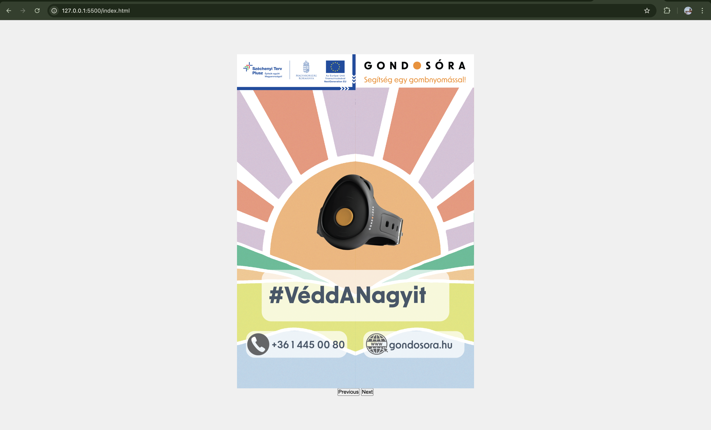
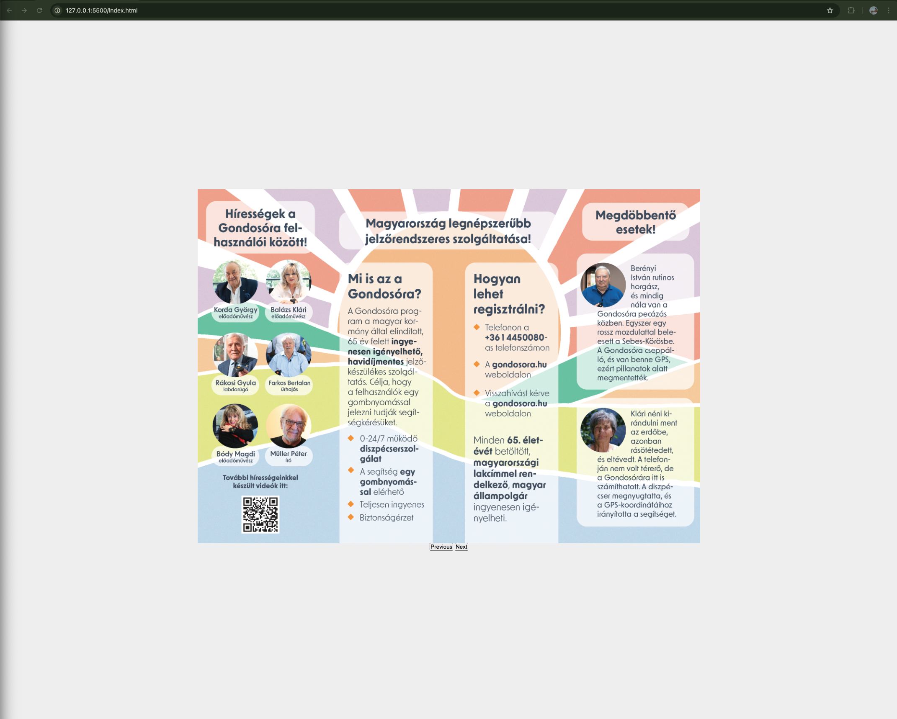

# Digital Gate Fold Brochure

A responsive, interactive digital gate fold brochure built with HTML, CSS, and JavaScript. This project simulates the physical experience of opening a gate fold brochure, offering an engaging, animated, and informative web experience.

## Demo



> [Live Demo](https://l4r4tw.github.io/Interactive-gate-fold-brochure/)

## Features

- **Interactive Fold Animation**: Mimics the gate fold effect, allowing users to open the brochure digitally.
- **Responsive Design**: Works on desktop and mobile devices, adapting the layout and interactions based on screen size. (soon)
- **JavaScript and CSS Animation**: Provides smooth, engaging animations using JavaScript and CSS.
- **Customizable Content**: Easily update content and images to fit various brochure themes.(soon)

## Technologies Used

- **HTML**: Structure and layout of the brochure.
- **CSS**: Styling, animations, and responsive design.
- **JavaScript**: Logic for interactivity and animations.

## Screenshots

| Closed Brochure View                          | Opened Brochure View                          |
| --------------------------------------------- | --------------------------------------------- |
|  |  |

## Getting Started

Follow these steps to get a local copy of the project up and running.

### Prerequisites

- A web browser (Chrome, Firefox, Safari, etc.)
- [Git](https://git-scm.com) for cloning the repository (optional)

### Installation

1. **Clone the Repository**:

   ```bash
   git clone https://github.com/yourusername/digital-gate-fold-brochure.git
   ```

2. **Navigate to the Project Folder**:

   ```bash
   cd digital-gate-fold-brochure
   ```

3. **Open `index.html` in your browser**:
   You can double-click the `index.html` file, or use a live server if you’re working in an IDE like Visual Studio Code.

### Usage

1. Open the brochure on a desktop or mobile device.
2. Interact with the brochure by clicking or swiping (if mobile).
3. Enjoy the gate fold animation and navigate through the brochure's content.

## Project Structure

Here’s a quick look at the file structure:

```
digital-gate-fold-brochure/
├── index.html         # Main HTML file
├── styles.css          # CSS styles and animations
├── main.js          # JavaScript for interactivity
└── images/            # Folder for images used in the brochure
```

## Customization

To modify the brochure content:

1. **HTML Content**: Update the text, images, and sections in `index.html`.
2. **CSS Styling**: Customize styles in `style.css` to change colors, fonts, or animations.
3. **JavaScript Functionality**: Modify `script.js` to change or add new interactive behaviors.

## Contributing

Contributions are welcome! Please open an issue or create a pull request with any improvements.

1. Fork the repository.
2. Create your feature branch: `git checkout -b feature/YourFeature`.
3. Commit your changes: `git commit -m 'Add your feature'`.
4. Push to the branch: `git push origin feature/YourFeature`.
5. Open a pull request.

## License

This project is open source and available under the [MIT License](LICENSE).

## Contact

If you have any questions, feel free to reach out:

- **Your Name** - [bruno.banoczi@gmail.com](mailto:bruno.banoczi@gmail.com)
- **GitHub** - [@l4r4TW](https://github.com/l4r4TW)
